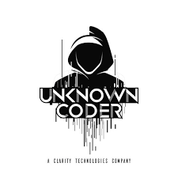

# 🚀 Ashok Bhatt's Personal Portfolio Website

Welcome to my personal portfolio website! This project is a modern, interactive, and fully responsive portfolio built with **React** and **Vite**, styled using **Tailwind CSS**. It showcases my skills, projects, achievements, coding profiles, and more—all in one place.



---

## 🌟 Features

- **Beautiful Hero Section:** Eye-catching introduction with animated typing effect and social links.
- **About Me:** Learn more about my background, education, and top skills.
- **Skills & Abilities:** Visually engaging, animated skill wheel highlighting my tech stack.
- **Projects Showcase:** Interactive project slider with live demo and code links.
- **Coding Profiles:** Integrated stats from LeetCode and GeeksforGeeks, including badges, ranks, and contest data.
- **Certificates:** Carousel of earned certificates with details.
- **Achievements:** Timeline of major milestones and awards.
- **Contact Form:** Easy-to-use form to reach out, plus direct email, phone, and location info.
- **Dark Mode:** Seamless light/dark theme support.
- **Responsive Design:** Looks great on all devices.

---

## 🖥️ Tech Stack

- **Frontend:** React, Vite
- **Styling:** Tailwind CSS
- **Icons:** React Icons
- **Forms & Validation:** react-hook-form
- **Notifications:** react-toastify
- **Charts:** chart.js, react-chartjs-2
- **API Integration:** axios

---

## 📸 Screenshots

> _Add your own screenshots here!_

---

## 🚦 Getting Started

### 1. **Clone the Repository**
```bash
git clone https://github.com/your-username/personal-portfolio-website.git
cd personal-portfolio-website
```

### 2. **Install Dependencies**
```bash
npm install
```

### 3. **Run the Development Server**
```bash
npm run dev
```

The app will be available at [http://localhost:5173](http://localhost:5173) (or as shown in your terminal).

---

## 🛠️ Customization

- **Update your details:** Edit the files in `src/Component/` and `src/Constants/` to personalize your info, projects, skills, certificates, and achievements.
- **Images:** Place your images in `public/Images/` and update the paths as needed.
- **Social Links:** Update your social and coding profile links in the `Intro` and `CodingProfiles` components.

---

## 📂 Folder Structure

```
├── public/
│   └── Images/           # Profile, project, and skill images
├── src/
│   ├── Component/        # All React components
│   ├── Constants/        # Data for projects, skills, etc.
│   ├── App.jsx           # Main app component
│   └── ...
├── package.json
├── vite.config.js
└── README.md
```

---

## 🙋‍♂️ About Me

I am **Ashok Bhatt**, a final-year B.Tech Computer Science student and aspiring software developer. I love building modern web applications, solving challenging problems, and continuously learning new technologies.

- **Institute:** ITM(SLS) Baroda University
- **Top Skills:** Web Development, Python, C++, Data Structures and Algorithms
- **Contact:** ashokbhatt2048@gmail.com | [LinkedIn](https://www.linkedin.com/in/ashokbhatt2048/) | [GitHub](https://github.com/Ashok-Bhatt/)

---

## 🤝 Contributing

Contributions are welcome! Feel free to fork the repo, open issues, or submit pull requests.

---

## 📄 License

This project is open source and available under the [MIT License](LICENSE).

---

> _Made with ❤️ by Ashok Bhatt_
